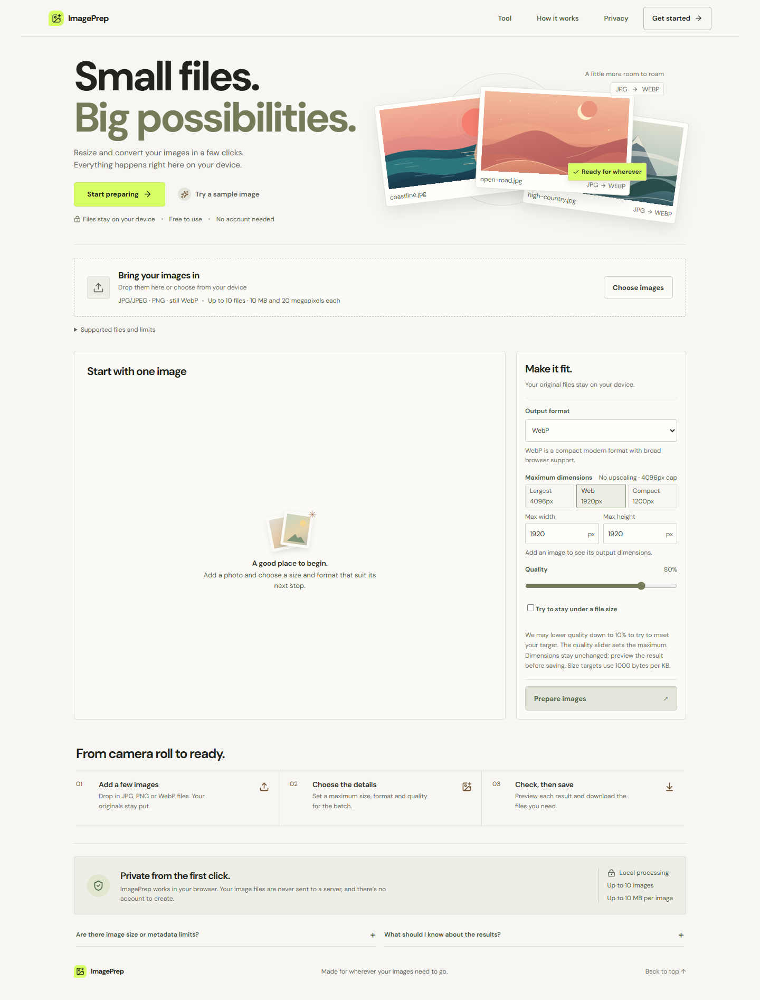

# ImagePrep

**Small files. Big possibilities.** A free, open-source browser tool for resizing and
converting images individually or in small batches. Image contents stay on your
device; no account or image-processing server is required.

**[Use ImagePrep live](https://imageprep.pages.dev/)** ·
[Source on GitHub](https://github.com/Christian-11a/imageprep)



## Start on Windows

Double-click **START-IMAGEPREP.cmd** in this folder. It opens the local app in your
browser. Keep its terminal window open while using the app; close it when done.
Dependencies are already installed in this checkout. After cloning elsewhere,
the launcher installs them on first use, which needs internet access.

Or open PowerShell in this folder:

```powershell
npm.cmd install
npm.cmd run dev
```

Open the address printed in the terminal, normally `http://127.0.0.1:5173`.
The server may choose another port if that one is occupied. `npm.cmd` avoids
PowerShell script execution-policy problems with `npm.ps1`.

Requirements: Node.js 24 LTS and a modern browser. The development toolchain
requires Node.js 20.19+ or 22.12+; Node.js 24 is the recommended version here.

## Use it

1. Add JPEG, PNG, or WebP files, or try the built-in sample.
2. Choose an output format, maximum dimensions, and JPEG/WebP quality.
3. Prepare the images. Dimensions stay proportional and images are never enlarged.
4. Open a preview to compare original and prepared images.
5. Download one file or all successful outputs in a ZIP.

For transparent inputs converted to JPEG, select the fill color. PNG and WebP
preserve transparency. PNG has no lossy quality setting and may produce larger
files. Size changes reflect actual exported bytes, including increases.

Changing settings clears previous outputs so downloads cannot accidentally use
outdated settings. Dimension and target-size edits commit when the field loses
focus, so typing does not repeatedly discard results. Each invalid field has its
own message. Cancellation stops after the active image; completed outputs remain
available. Rejected files have individual reasons and recovery advice and do not
consume a slot ahead of valid inputs.

For JPEG or WebP, optionally set a file-size target in decimal KB (1000 bytes).
The app tries up to seven quality levels between the chosen maximum and 10%,
without changing dimensions. It clearly reports targets it cannot meet; reduce
dimensions and prepare again if needed. PNG does not offer this lossy size control.
Clear all offers a 15-second undo window. Adding files, preparing, or changing
settings ends that window; undo keeps only one bounded batch in memory.

## Limits and compatibility

- 10 images per batch, 10 MiB per file, and 20 megapixels per decoded image.
- Total batch input: 50 MiB and 40 megapixels. Split larger sets into batches.
- Output dimensions from 1 to 4096 pixels per side.
- JPEG, PNG, and WebP still images only. Animated WebP/APNG are rejected when
  detected. GIF, HEIC, RAW, SVG, and AVIF inputs are outside the first release.
- Export support is browser-dependent. Unsupported exports produce a useful error
  instead of silently downloading the wrong format.
- Image metadata may be lost. Color profiles and rendering can change; inspect
  results before using them. This tool is for web-image preparation, not archival
  preservation or professional color work.
- Large batches use device memory. Conservative limits reduce risk but do not
  guarantee every low-memory phone can process every allowed image.
- File-size targets are best effort; outputs can exceed an unattainable target.

See [VERIFICATION.md](docs/VERIFICATION.md) for actual browser checks and any
remaining limitations. Safari/iOS compatibility is not assumed without testing.

Cloudflare Pages is the selected public host. See [DEPLOYMENT.md](docs/DEPLOYMENT.md)
for the build settings and live-release checks, and [ROADMAP.md](ROADMAP.md) for
planned updates.

## Development

```powershell
npm.cmd ci
npm.cmd run dev
npm.cmd run check
npm.cmd run test:e2e
```

`check` runs unit tests and the TypeScript/production build. Browser tests use
installed Microsoft Edge by default, avoiding a separate browser download on
Windows. To use Playwright Chromium, change the project in `playwright.config.ts`
and install that browser through Playwright. To test an installed Chrome instead,
set `$env:IMAGEPREP_TEST_BROWSER = 'chrome'` before running the tests, then remove
that environment variable when done. Managed Firefox can be selected with
`IMAGEPREP_TEST_BROWSER=firefox` after installing it with Playwright.
Browser-test reports are generated locally and ignored by Git.

```powershell
npm.cmd run build
npm.cmd run preview
npm.cmd run test:production
```

The production output is `dist/`. Relative asset URLs allow the app to work below
a GitHub repository path as well as at the domain root. `test:production` verifies
the built app mounted under `/ImagePrep/`, including the lazy ZIP bundle and a
real download; it uses installed Microsoft Edge and closes its test server.

## Architecture

```text
src/App.tsx                    Page composition and tool integration
src/components/                Settings, image rows, and native preview dialog
src/styles.css                 Responsive design and interaction states
src/fonts.css                  Locally bundled variable DM Sans font
src/assets/                    Original landscape SVG illustrations
src/hooks/useReveal.ts          Motion preferences and section reveals
src/hooks/useImageBatch.ts      Batch state, cancellation, and URL ownership
src/lib/imageProcessing.ts      Validation, decoding, resizing, and export
src/lib/downloads.ts            Individual downloads and ZIP generation
src/lib/sample.ts               Original sample generated on-device
src/types.ts                   Shared contracts and limits
tests/                         Actual-browser workflow and processing checks
```

React + TypeScript handle the interface. Canvas handles resizing and export.
JSZip is loaded when needed for batch downloads. Image processing is sequential
to limit peak memory. Object URLs and decoded image resources are released when
no longer needed. DM Sans is bundled locally; there are no remote font requests,
analytics, or image APIs. Motion uses CSS and Intersection Observer, respects
reduced-motion preferences, and needs no animation framework.

See [the design notes](docs/DESIGN.md) for the visual system and interaction choices.

## Deployment

The public app is hosted at [imageprep.pages.dev](https://imageprep.pages.dev/)
on Cloudflare Pages. Pushes to `main` automatically build and deploy updates.
Build settings are documented in [DEPLOYMENT.md](docs/DEPLOYMENT.md).
The separate Check workflow runs unit tests and the production build on pushes
and pull requests. The manual GitHub Pages workflow is an unused alternative.

No paid backend, storage, API, or purchased domain is required. Development tools
or assistance can have their own costs independent of the app.

## Open source and portfolio

MIT licensed. See [CONTRIBUTING.md](CONTRIBUTING.md) and
[the portfolio case study](docs/PORTFOLIO.md). The demo landscape is generated by
the app and uses no third-party image assets. Dependencies retain their respective
licenses; see [THIRD-PARTY.md](docs/THIRD-PARTY.md).
